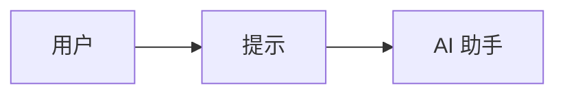
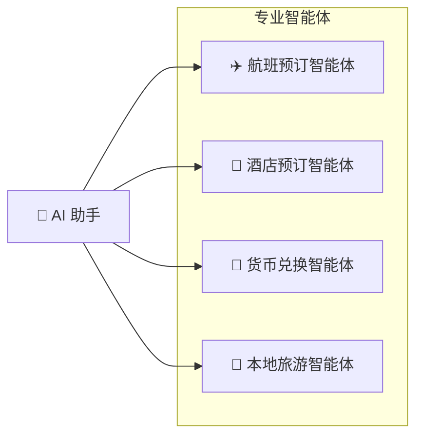
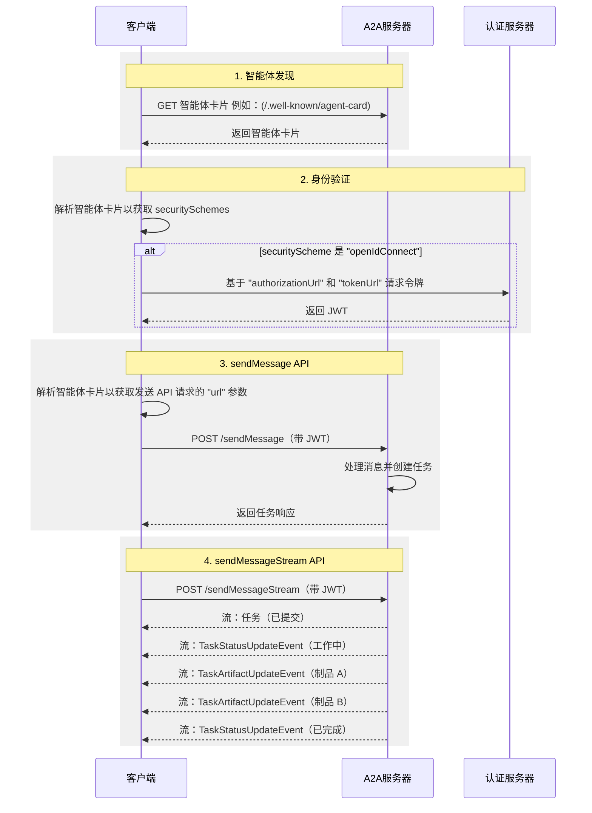

# 什么是 A2A？

A2A 协议是一个开放标准，能够实现 AI 智能体之间的无缝通信和协作。它为使用不同框架和来自不同供应商构建的智能体提供了一种通用语言，促进互操作性并打破孤岛。智能体是在其环境中独立行动的自主问题解决者。A2A 允许来自不同开发者、基于不同框架、由不同组织拥有的智能体团结起来并协同工作。

## 为什么使用 A2A 协议

A2A 解决了 AI 智能体协作中的关键挑战。它为智能体交互提供了标准化的方法。本节解释了 A2A 解决的问题及其带来的好处。

### A2A 解决的问题

考虑用户向 AI 助手请求规划国际旅行。此任务涉及协调多个专业智能体，例如：

- 航班预订智能体
- 酒店预订智能体
- 本地旅游推荐智能体
- 货币兑换智能体

如果没有 A2A，集成这些不同的智能体会带来几个挑战：

- **智能体暴露**：开发者经常将智能体包装为工具以向其他智能体暴露它们，类似于在多智能体控制平台（模型上下文协议）中暴露工具的方式。然而，这种方法效率低下，因为智能体被设计为直接协商。将智能体包装为工具会限制其能力。A2A 允许智能体按原样暴露，而无需这种包装。
- **自定义集成**：每次交互都需要自定义的点对点解决方案，造成大量工程开销。
- **创新缓慢**：针对每个新集成的定制开发减缓了创新速度。
- **可扩展性问题**：随着智能体和交互数量的增长，系统变得难以扩展和维护。
- **互操作性**：这种方法限制了互操作性，阻碍了复杂 AI 生态系统的有机形成。
- **安全漏洞**：临时通信往往缺乏一致的安全措施。

A2A 协议通过建立 AI 智能体可靠和安全交互的互操作性来解决这些挑战。

### A2A 示例场景

本节提供了一个示例场景，以说明使用 A2A（智能体到智能体）协议进行 AI 智能体之间复杂交互的好处。

#### 用户的复杂请求

用户与 AI 助手交互，给出复杂的提示，如"规划一次国际旅行"。

#### 协作的需求

AI 助手接收到提示并意识到需要调用多个专业智能体来完成请求。这些智能体包括航班预订智能体、酒店预订智能体、货币兑换智能体和本地旅游智能体。

#### 互操作性挑战

核心问题：智能体无法协同工作，因为每个智能体都有自己的定制开发和部署。

缺乏标准化协议的后果是，这些智能体无法相互协作，更不用说发现彼此的能力。各个智能体（航班、酒店、货币和旅游）是孤立的。

#### "使用 A2A"的解决方案

A2A 协议提供了标准方法和数据结构，使智能体能够相互通信，无论其底层实现如何，因此相同的智能体可以作为互连系统使用，通过标准化协议无缝通信。

现在充当协调者的 AI 助手从所有启用 A2A 的智能体接收到统一的信息。然后，它将单个完整的旅行计划作为对用户初始提示的无缝响应呈现出来。

### A2A 的核心优势

实施 A2A 协议在整个 AI 生态系统中带来显著优势：

- **安全协作**：如果没有标准，很难确保智能体之间的安全通信。A2A 使用 HTTPS 进行安全通信，并保持操作不透明，因此智能体在协作期间无法看到其他智能体的内部工作原理。
- **互操作性**：A2A 打破了不同 AI 智能体生态系统之间的孤岛，使来自不同供应商和框架的智能体能够无缝协作。
- **智能体自主性**：A2A 允许智能体在与其他智能体协作时保留其个体能力并作为自主实体行动。
- **降低集成复杂性**：该协议标准化了智能体通信，使团队能够专注于其智能体提供的独特价值。
- **支持 LRO**：该协议支持长时间运行的操作（LRO）以及使用服务器发送事件（SSE）和异步执行的流式传输。

### A2A 的关键设计原则

A2A 开发遵循优先考虑广泛采用、企业级能力和面向未来的原则。

- **简单性**：A2A 利用现有标准，如 HTTP、JSON-RPC 和服务器发送事件（SSE）。这避免了重新发明核心技术，并加速了开发者的采用。
- **企业就绪**：A2A 满足关键的企业需求。它与标准 Web 实践保持一致，以实现强大的身份验证、授权、安全性、隐私、跟踪和监控。
- **异步**：A2A 原生支持长时间运行的任务。它处理智能体或用户可能不会持续保持连接的场景。它使用流式传输和推送通知等机制。
- **模态独立**：该协议允许智能体使用各种内容类型进行通信。这实现了超越纯文本的丰富和灵活的交互。
- **不透明执行**：智能体有效协作而不暴露其内部逻辑、内存或专有工具。交互依赖于声明的能力和交换的上下文。这保护了知识产权并增强了安全性。

### 理解智能体栈：A2A、MCP、智能体框架和模型

A2A 位于更广泛的智能体栈中，其中包括：

- **A2A：** 标准化在不同组织中部署并使用不同框架开发的智能体之间的通信。
- **MCP：** 将模型连接到数据和外部资源。
- **框架（如 ADK）：** 提供构建智能体的工具包。
- **模型：** 对智能体的推理至关重要，这些可以是任何大型语言模型（LLM）。

#### A2A 和 MCP

在 AI 通信的更广泛生态系统中，您可能熟悉旨在促进智能体、模型和工具之间交互的协议。值得注意的是，模型上下文协议（MCP）是一个新兴标准，专注于将大型语言模型（LLM）与数据和外部资源连接起来。

智能体到智能体（A2A）协议旨在标准化 AI 智能体之间的通信，特别是那些部署在外部系统中的智能体。A2A 旨在补充 MCP，解决智能体交互的不同但相关的方面。

- **MCP 的重点：** 降低将智能体与工具和数据连接起来的复杂性。工具通常是无状态的，执行特定的预定义功能（例如，计算器、数据库查询）。
- **A2A 的重点：** 使智能体能够在其原生模态中协作，允许它们作为智能体（或作为用户）进行通信，而不是被限制在类似工具的交互中。这实现了复杂的多轮交互，其中智能体进行推理、计划并将任务委派给其他智能体。例如，这促进了涉及协商或澄清的多轮交互，例如下订单时的交互。

将智能体封装为简单工具的做法从根本上是有限的，因为它无法捕获智能体的全部能力。这一关键区别在文章[为什么智能体不是工具](https://discuss.google.dev/t/agents-are-not-tools/192812)中进行了探讨。

有关更深入的比较，请参阅 [A2A 和 MCP 比较](a2a-and-mcp.md)文档。

#### A2A 和 ADK

[智能体开发工具包（ADK）](https://google.github.io/adk-docs)是 Google 开发的开源智能体开发工具包。A2A 是智能体的通信协议，可实现智能体间通信，无论用于构建它们的框架如何（例如，ADK、LangGraph 或 Crew AI）。ADK 是一个灵活且模块化的框架，用于开发和部署 AI 智能体。虽然针对 Gemini AI 和 Google 生态系统进行了优化，但 ADK 是模型无关的、部署无关的，并且为与其他框架的兼容性而构建。

### A2A 请求生命周期

A2A 请求生命周期是一个详细说明请求遵循的四个主要步骤的序列：智能体发现、身份验证、`sendMessage` API 和 `sendMessageStream` API。下图更深入地展示了操作流程，说明了客户端、A2A 服务器和身份验证服务器之间的交互。

## 下一步

了解构成 A2A 协议基础的[关键概念](./key-concepts.md)。
